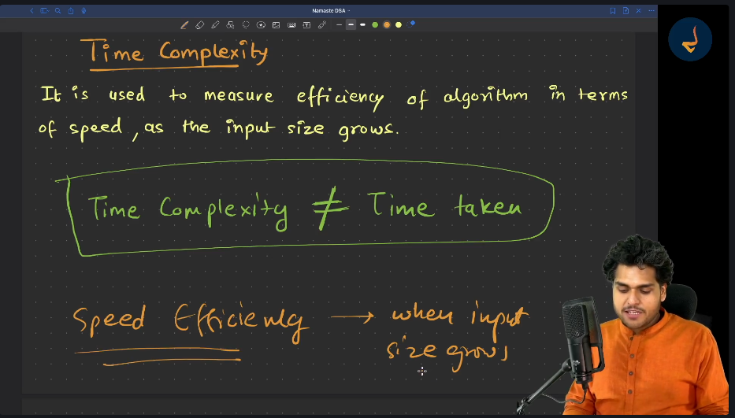
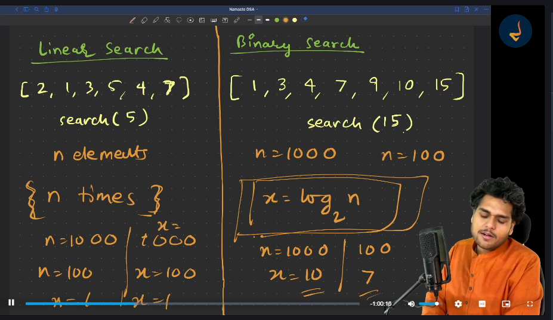
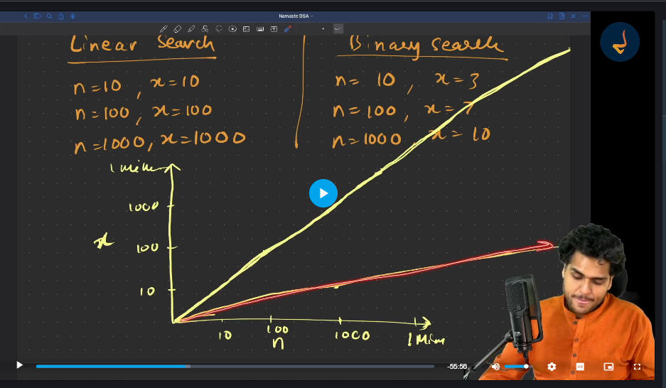
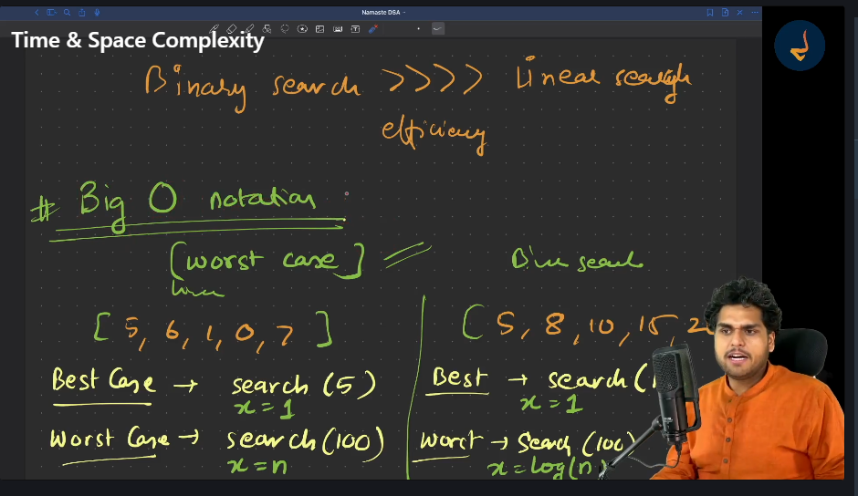
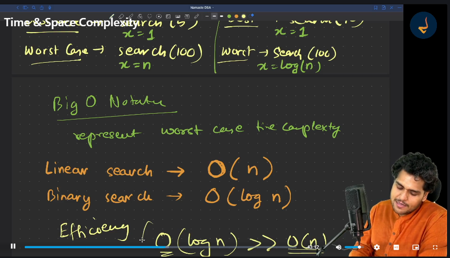
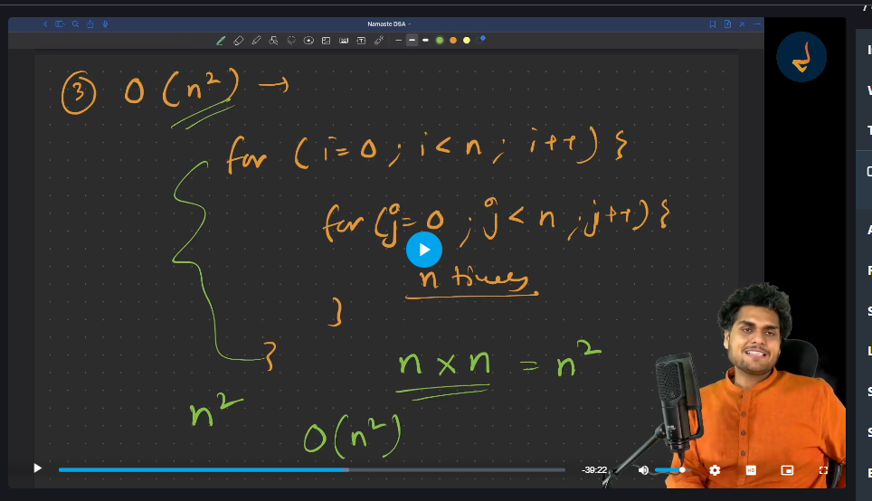
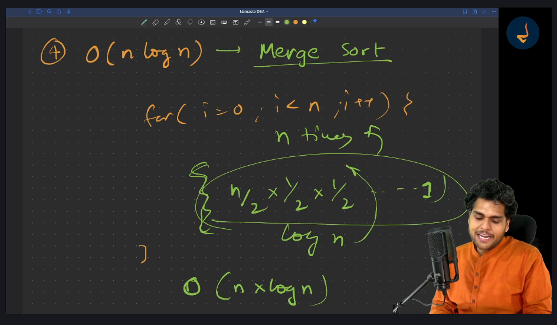

## 📘 DSA Concepts with JavaScript

This repository contains my personal notes, code implementations, and explanations of **Data Structures and Algorithms (DSA)** concepts using **JavaScript**.

### 📌 What you'll find here:

* 📚 Clear explanations of DSA concepts
* 🧠 Step-by-step logic breakdowns
* 💻 JavaScript implementations of problems
* 🔁 Continuous updates as I learn and revise

### 🔍 Topics Covered:

* Arrays, Strings, Objects
* Recursion, Sorting, Searching
* Stacks, Queues, Linked Lists
* Trees, Graphs, Heaps, Hash Tables
* Dynamic Programming, Greedy Algorithms
* Problem-solving patterns and optimizations

### 🚀 Goal:

To strengthen my DSA foundation for technical interviews and real-world problem-solving, and to make this a helpful reference for others learning DSA with JavaScript.


## Javascript Array's:

An array in JavaScript is a data structure that can store multiple values of different data types in a single variable.
It keeps the values in order and lets us access them using their indexex (starting from 0).

for eg:
```Javascript
let mixedArray = [42, "hello", true, null];
console.log(mixedArray[1]); // Output: "hello"
```

# JavaScript Objects

A **JavaScript object** is a data structure which allows us to store data in the form of **key-value pairs**. It helps in organizing and accessing data efficiently.

Each key (also known as a property) is a string, and its corresponding value can be any data type, including numbers, strings, arrays, functions, or even other objects.
```js
const objectName = {
  key1: value1,
  key2: value2,
  // more key-value pairs
};
```

JavaScript Program to Find Lagest Number in An Array:

```javascript
function largestNum(arr) {
  let largest = arr[0];

  for (let i = 0; i < arr.length; i++) {
    if (arr[i] > largest) {
      largest = arr[i];
    }
  }
  return largest;
}
console.log(largestNum([12, 13, 100, 45, 67]));
```

javascript Program to find smallest Number in An array:

```javascript
function smallest(arr){
  let smallest = Infinity
  
  for(let i=0;i<arr.length;i++){
    if(arr[i]<smallest ){
      smallest = arr[i]
    }
  }
  return smallest
}
console.log(smallest([12,13,100,45,67]))
```

### Math.floor()
Use: Rounds a number down to the nearest integer.
```javascript
console.log(Math.floor(4.9));  // Output: 4
console.log(Math.floor(-4.9)); // Output: -5
```

### Math.ceil()
Use: Rounds a number up to the nearest integer.
```javascript
console.log(Math.ceil(4.1));   // Output: 5
console.log(Math.ceil(-4.1));  // Output: -4
```

Math.round()
Use: Rounds a number to the nearest integer.
```javascript
console.log(Math.round(4.4));  // Output: 4
console.log(Math.round(4.5));  // Output: 5
console.log(Math.round(-4.5)); // Output: -4
```

### Math.abs()
Use: Returns the absolute value (always positive).
```javascript
console.log(Math.abs(-7));     // Output: 7
console.log(Math.abs(7));      // Output: 7
console.log(Math.abs(-3.14));  // Output: 3.14
```
## Time and Space Complexity :
Time Complexity is used to measure the efficiency of the algorithm in terms of speed as the input size grows.

Time complexity does not mean that time it takes to run the algorithm as time it takes to run the algorithm might depend upon your hardware
and sofware and it could different for different systems.


As we can clearly see from Below Graph as Number of Elements (n) or Input Size increases the Number of Operations (x) also Increases in
 __Linear Search__.


But in Case of __Binary-Search(Red Line)__ that is not the case. So the efficiency becomes (n/2^x) where x is the number of operations.

To Re-present **Time complexities** we use something known as __Big-O (O) Notation__ which measures the Time Complexities in __Worst Case__.


### What is Notation :
Notation is a Symbol to represent Something. So here Big-O (O) is also a symbol to represent Worst Case Time complexity.


So in image we can see the Big-O represenation of Linear and Binary Search.



As in above Image when an inner Loop runs similar to outer loop then Time complexity becomes O(n^2) times.



So Suppose we have a outer loop like in Above Image and inside that we have an operation like Binary Search Then Time complexity becomes __n log n__ times.